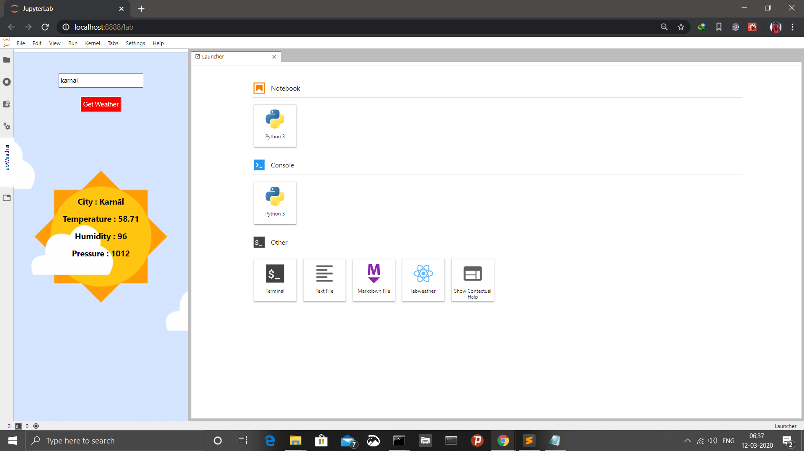
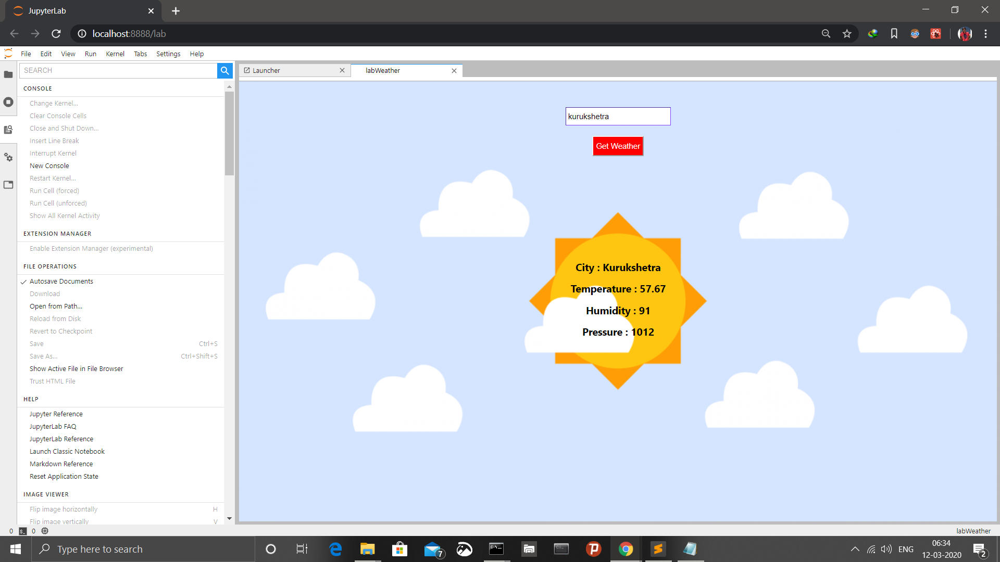
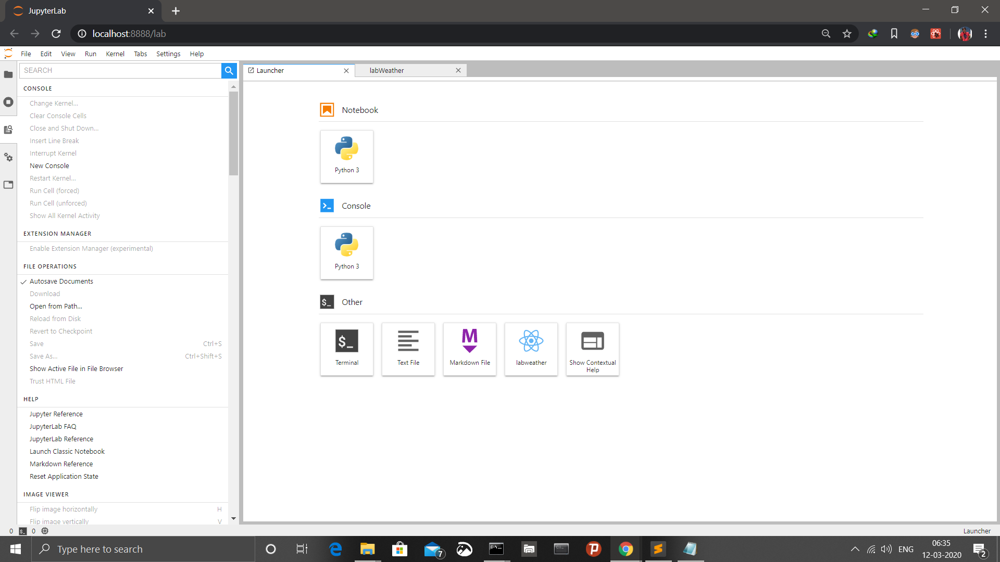

# labweather

Jupyter lab weather extension made using ReactJs.

## Weather JupyterLab extension

Extension published on npm : @meyash/labweather
Link : https://www.npmjs.com/package/@meyash/labweather  

Installation Instructions :
1) conda create -n labweather jupyterlab nodejs
2) conda activate labweather
3) jupyter labextension install @meyash/labweather
4) jupyter lab

I tried 3 ways of running extensions :
1) via launcher icon
2) via left side bar
3) via command palette

In my published extension I have used the 1st way i.e accessing via launcher icon.

screenshots : 




---

## Requirements

* JupyterLab >= 1.0

## Install

```bash
jupyter labextension install @meyash/labweather
```

## Contributing

### Install

The `jlpm` command is JupyterLab's pinned version of
[yarn](https://yarnpkg.com/) that is installed with JupyterLab. You may use
`yarn` or `npm` in lieu of `jlpm` below.

```bash
# Clone the repo to your local environment
# Move to labweather directory
# Install dependencies
jlpm
# Build Typescript source
jlpm build
# Link your development version of the extension with JupyterLab
jupyter labextension link .
# Rebuild Typescript source after making changes
jlpm build
# Rebuild JupyterLab after making any changes
jupyter lab build
```

You can watch the source directory and run JupyterLab in watch mode to watch for changes in the extension's source and automatically rebuild the extension and application.

```bash
# Watch the source directory in another terminal tab
jlpm watch
# Run jupyterlab in watch mode in one terminal tab
jupyter lab --watch
```

### Uninstall

```bash
jupyter labextension uninstall @meyash/labweather
```

