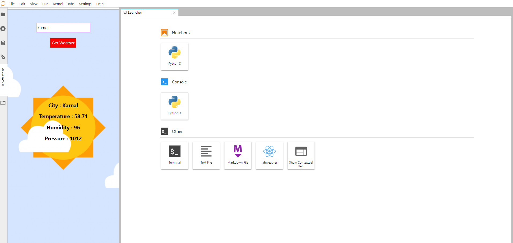
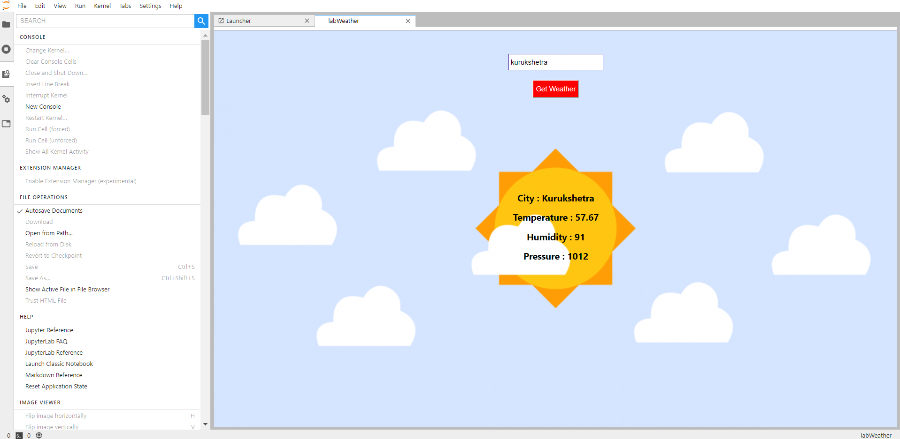
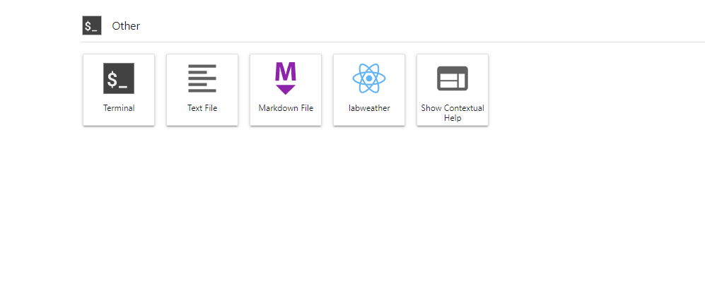

<h1 align="center">
  <br>
  <a href=""></a>
  <br>
    Jlab Weather Extension | ReactJs | TypeScript
  <br>
</h1>

<h4 align="center">JupyterLab is the next-generation web-based user interface for Project Jupyter.</h4>

## Weather JupyterLab extension

- Extension published on npm : @meyash/labweather
- Link : https://www.npmjs.com/package/@meyash/labweather  

### Installation Instructions

1) conda create -n labweather jupyterlab nodejs
2) conda activate labweather
3) jupyter labextension install @meyash/labweather
4) jupyter lab

### Ways to run an extension in JupyterLab

1) via launcher icon
2) via left side bar
3) via command palette

This extension can be accessed via Launcher Icon.

### Screenshots

<br />





## Requirements

* JupyterLab >= 1.0

## Installation

```bash
jupyter labextension install @meyash/labweather
```

## Contributing

### Install

The `jlpm` command is JupyterLab's pinned version of
[yarn](https://yarnpkg.com/) that is installed with JupyterLab. You may use
`yarn` or `npm` in lieu of `jlpm` below.

```bash
# Clone the repo to your local environment
# Move to labweather directory
# Install dependencies
jlpm
# Build Typescript source
jlpm build
# Link your development version of the extension with JupyterLab
jupyter labextension link .
# Rebuild Typescript source after making changes
jlpm build
# Rebuild JupyterLab after making any changes
jupyter lab build
```

You can watch the source directory and run JupyterLab in watch mode to watch for changes in the extension's source and automatically rebuild the extension and application.

```bash
# Watch the source directory in another terminal tab
jlpm watch
# Run jupyterlab in watch mode in one terminal tab
jupyter lab --watch
```

### Uninstall

```bash
jupyter labextension uninstall @meyash/labweather
```

## License

[](/LICENSE)

By [Yashwant](https://github.com/meyash)

## Contributors

<br />

<a href="https://meyash.xyz/" style="margin-right:30px;"></a>
<a href="https://meyash.xyz/resume.pdf" style="margin-right:30px;"></a> 
<a href="https://www.linkedin.com/in/meyash21/" style="margin-right:30px;"></a>
<a href="https://twitter.com/meyash21" style="margin-right:30px;"></a>
<a href="https://www.instagram.com/meyash21/" style="margin-right:30px;"></a>
<a href="https://www.codechef.com/users/meyash21" style="margin-right:30px;"></a>  